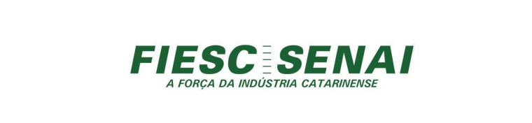
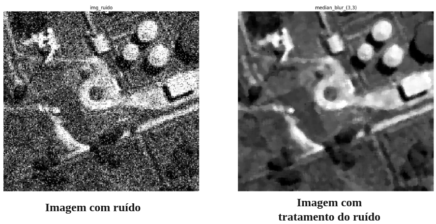
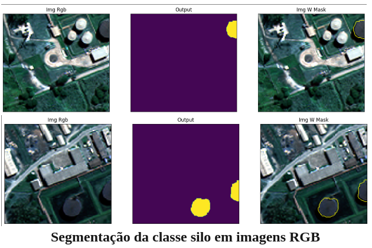
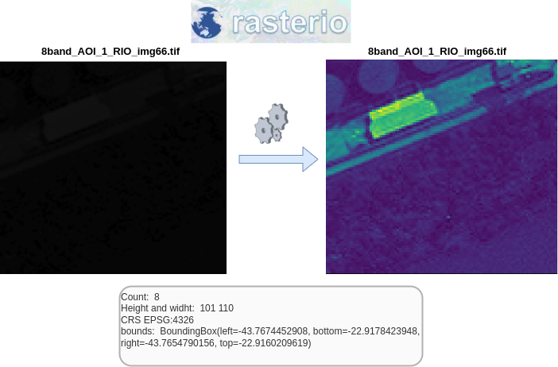
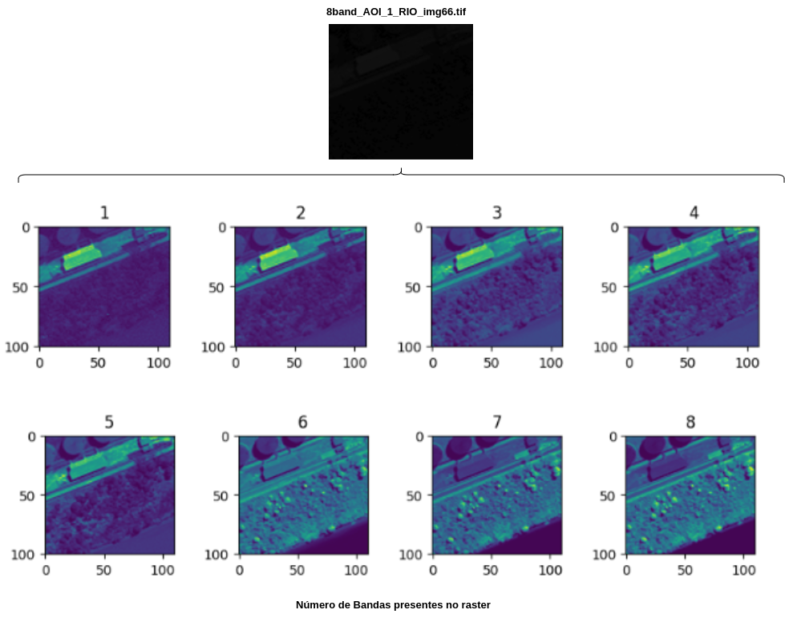
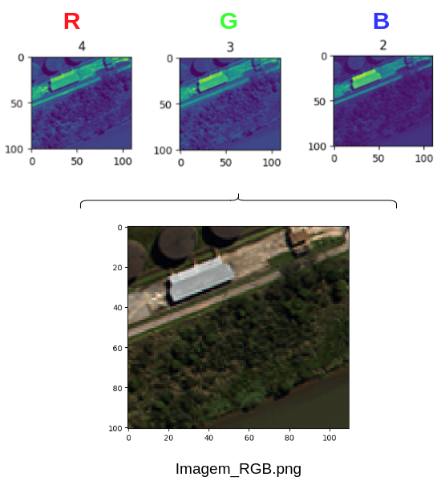
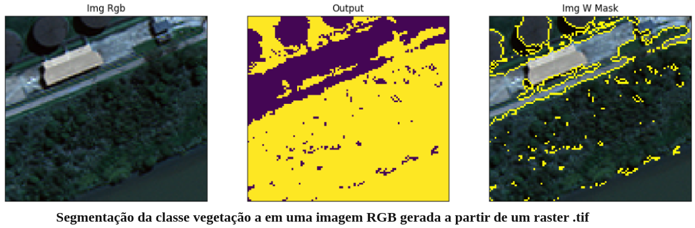

# remote_sensing_satellite_images

Este repositório tem como principal objetivo mostrar uma série de técnicas de visão computacional aplicadas ao sensoreamento remoto em imagens satelitais para realizar tarefas como remoção de ruido em imagens e segmentação de pixels em diferentes cenários. Para isto foram utilizadas uma série bibliotecas tais como rasterio, gdal e earthpy a fim de realizar o tratamento e visualização dos dados satelitais.  

Para o processamento das imagens foram utilizadas técnicas clássicas de visão computacional como transformação de espaço de cores, pre e pós processamento de imagens e transformações morfológicas, além da utilização da arquitetura U-net baseada em deep learning para treinar um modelo que vise realizar a segmentação de residências em um conjunto de imagens satelitais.

## Installation

### Ambiente virtual
Para a instalação do repositório e as dependências recomenda-se criar um ambiente virtual. 

```
python3 -m venv sat_imgs_vc
source sat_imgs_vc/bin/activate
```
Como alternativa pode ser instalado um ambiente virtual conda 

```
conda create --name sat_imgs_vc
conda activate sat_imgs_vc
```
### Requirements
Uma vez ativado o ambiente virtual pode ser instaladas as diferentes dependências:  

  - Python >= 3.6
  - keras >= 2.2.0 or tensorflow >= 1.13
  - CUDA > 9.0
  - segmenation-models==1.0
  - albumentations==0.3.0 

A arquitetura de deep Learning  utilizada para realizar a tarefa de segmentação de pixels foi a [U-net](https://arxiv.org/abs/1505.04597). A implementação e treinamento da arquitetura foi realizada utilizando
o framework Tensorflow junto com Keras. 

```
pip install -U -q segmentation-models
pip install -q tensorflow==2.2.1
pip install -q keras==2.5
```
Sobre instalar as bibliotecas de CUDA and CudNN para realizar treinamentos com GPU pode observar o seguinte [link](https://santhoshpkumar.github.io/Cuda-Install-and-Setup/)
 

Instalar outros requerimentos (OpenCV, Rasterio, gdal, etc), para realizar tarefas de tratamento das imagens satelitais, assim como processamento das imagens utilizadas: 

```
pip install -r requirements.txt
```
## Images processing
Nesta seção amostra-se o procedimento para realizar os diferentes processamentos realizados sobre imagens satelitais. 
O script principal que deve ser executado se mostra a seguir: 

```
python3 main_images_processing.py  --rgb_img_noise = "caminho que contem a imagem rgb com ruido" --ath_seg_silo = "caminho que contem a imagem rgb para realizar a segmentação da classe silo"
    --path_seg_veg = "caminho que contem a imagem raster para realizar a segmentação da classe vegetação" --output = "caminho que contem o folder onde serão salvas as imagens"
```

Os resultados serão discutidos a continuação:

### Salt & Pepper noise Reduction

Para remover o fenómeno chamado de salt & Pepper sobre uma imagem dada, pode executar o seguinte script


observe como a partir de um processamento da imagem o ruído é removido. 



### RGB and raster processing for class segmentation

- Para realizar a segmentação de alguma classe predefinida em imagens satelitais (em formato RGB) considerando técnicas classicas de visão computacional pode ser utilizada a transformação para espaço de cores HSV. Para este caso em particular, foi segmentada a classe silo, observe como a partir da imagem original é criada uma mascara binaria onde os pixels classificados como 1 representam o objeto silo.

  

- Para realizar a segmentação de alguma classe predefinida em rasters satelitais (em formato .tif) contendo um número determinado de bandas primeiro deve ser realizado um pre-processamento do raster para separar cada uma de essas bandas. Para este caso foi utilizada a biblioteca [Rasterio](https://rasterio.readthedocs.io/en/stable/) para realizar o tratamento dos rasters.  

  

  A partir do raster carregado no Rasterio é possível extrair todas as bandas, observe que para este caso o raster contem um numero total de 8 bandas

  

  Depois, com a premissa de que as bandas 4, 3, e 2 representam os canais R, G, B respetivamente, realiza-se um procedimento de união delas, o resultado é ilustrado a seguir: 

   

  Por fim, a partir da imagem RGB gerada, é realizada a segmentação da classe vegetação a partir da transformação para o espaço de cores HSV, conforme apresentado na segmentação da classe silo.

  

  ## Deep learning training model

  Para realizar o treinamento do modelo foi utilizada uma arquitetura U-net, conforme apresentado anteriormente. O script para realizar o treinamento se descreve a continuação: 

  ```
python3 main_train_unet.py --path_folder = caminho que contem o folder com os dados de treinamento e validação --batch_size = Tamanho do batch que será utilizado no treinamento e validação --epochs = numero de épocas que seram utilizadas para realizar o treinamento
```

  


